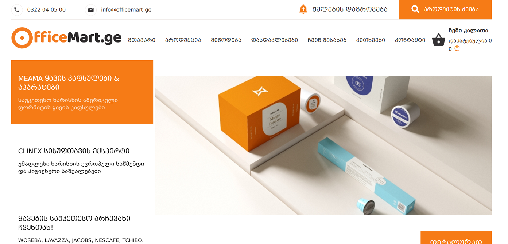

# PROJECT TITLE
## OFFICEMART.GE

# About
This is a test of the new site, checking its full functionality.
## Table of Contents
> Before opening the project, you must have the following programs downloaded to your computer
* [Java](#java)
* [Maven](#maven)
* [Allure](#allure)
* [IntelijIdea](#intelijidea)
* [Git Bash](#git-bash)
> You should write 
* [Dependencies](#dependencies)
> For open project
* [Open project](#git-clone)
## Java
- (https://www.oracle.com/java/technologies/downloads/#jdk20-windows)
## Maven
- (https://maven.apache.org/download.cgi)
## Allure
- (https://docs.qameta.io/allure)
## IntelijIdea
- (https://www.jetbrains.com/idea/download/?section=windows)
## Git Bash
- (https://git-scm.com/downloads)
## Dependencies
<modelVersion>4.0.0</modelVersion>

    <groupId>org.example</groupId>
    <artifactId>testngTest</artifactId>
    <version>1.0-SNAPSHOT</version>

    <properties>
        <maven.compiler.source>20</maven.compiler.source>
        <maven.compiler.target>20</maven.compiler.target>
        <project.build.sourceEncoding>UTF-8</project.build.sourceEncoding>
        <aspectj.version>1.9.19</aspectj.version>
    </properties>
    <dependencies>
        <dependency>
            <groupId>com.codeborne</groupId>
            <artifactId>selenide</artifactId>
            <version>6.14.0</version>
        </dependency>
        <!-- https://mvnrepository.com/artifact/org.testng/testng -->
        <dependency>
            <groupId>org.testng</groupId>
            <artifactId>testng</artifactId>
            <version>7.7.1</version>
            <scope>test</scope>
        </dependency>
        <dependency>
            <groupId>org.testng</groupId>
            <artifactId>testng</artifactId>
            <version>7.7.1</version>
            <scope>compile</scope>
        </dependency>
        <dependency>
            <groupId>org.apache.maven.plugins</groupId>
            <artifactId>maven-compiler-plugin</artifactId>
            <version>3.11.0</version>
        </dependency>
        <dependency>
            <groupId>org.slf4j</groupId>
            <artifactId>slf4j-simple</artifactId>
            <version>2.0.5</version>
        </dependency>
        <dependency>
            <groupId>net.sourceforge.jexcelapi</groupId>
            <artifactId>jxl</artifactId>
            <version>2.6.12</version>
        </dependency>
        <!-- https://mvnrepository.com/artifact/io.qameta.allure/allure-selenide -->
        <dependency>
            <groupId>io.qameta.allure</groupId>
            <artifactId>allure-selenide</artifactId>
            <version>2.22.0</version>
        </dependency>
        <!-- https://mvnrepository.com/artifact/io.qameta.allure/allure-testng -->
        <dependency>
            <groupId>io.qameta.allure</groupId>
            <artifactId>allure-testng</artifactId>
            <version>2.22.0</version>
        </dependency>
        <dependency>
            <groupId>org.aspectj</groupId>
            <artifactId>aspectjweaver</artifactId>
            <version>${aspectj.version}</version>
            <scope>runtime</scope>
        </dependency>
    </dependencies>
    <build>
        <plugins>
            <plugin>
                <groupId>org.apache.maven.plugins</groupId>
                <artifactId>maven-surefire-plugin</artifactId>
                <version>2.20</version>
                <configuration>
                    <suiteXmlFiles>
                        <suiteXmlFile>testng.xml</suiteXmlFile>
                    </suiteXmlFiles>
                    <includes>
                        <include>**/*Tests.java</include>
                    </includes>
                    <argLine>
                        -javaagent:"${settings.localRepository}/org/aspectj/aspectjweaver/${aspectj.version}/aspectjweaver-${aspectj.version}.jar"
                    </argLine>
                </configuration>
            </plugin>
        </plugins>
    </build>

</project>

## Git Clone
- Clone the repository
- https://github.com/kundzula/OFFICEMART.git
- After you clone this repo to your desktop
